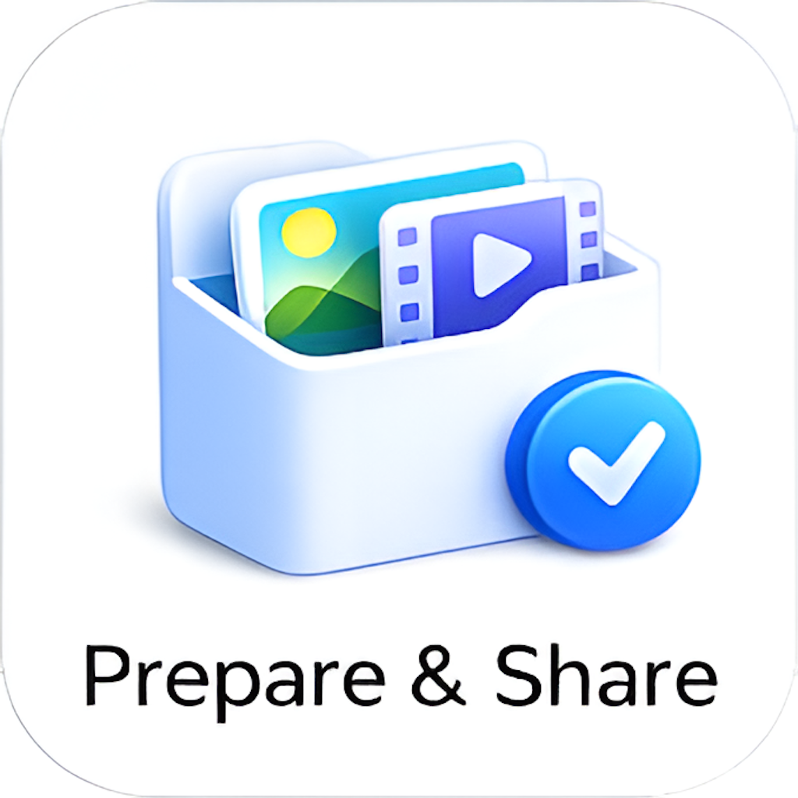
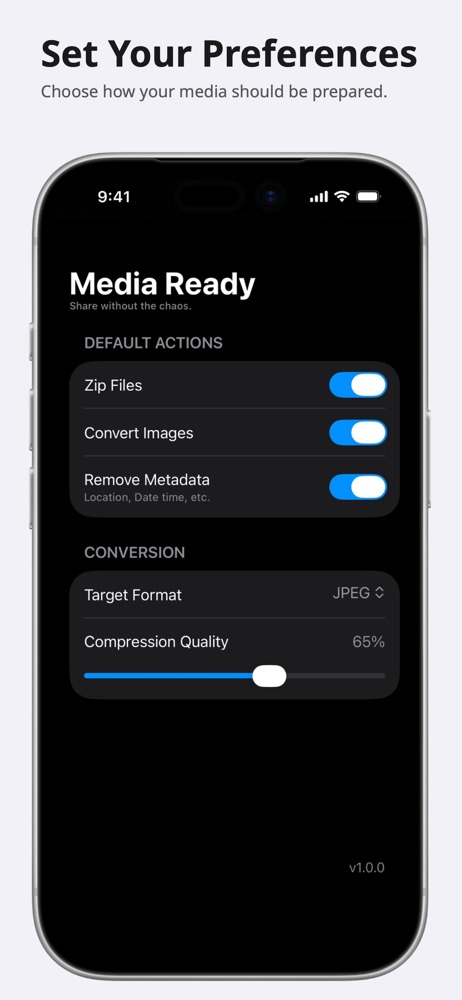
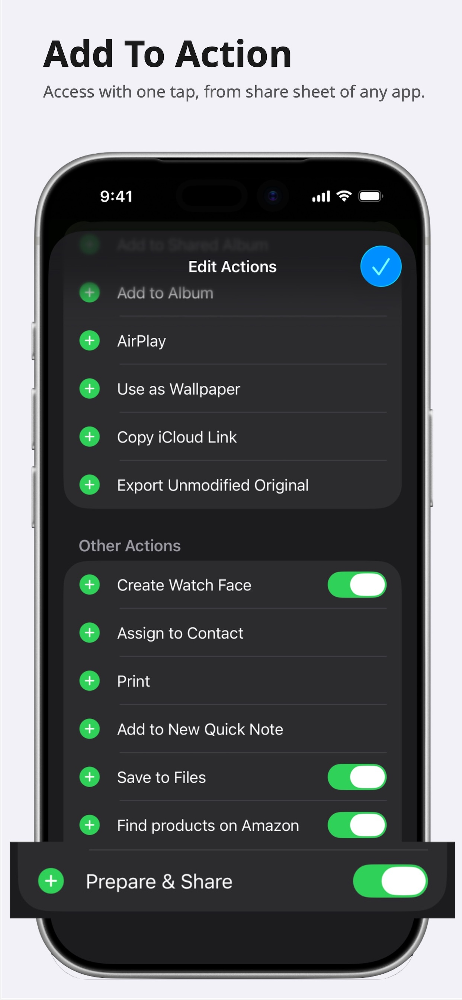
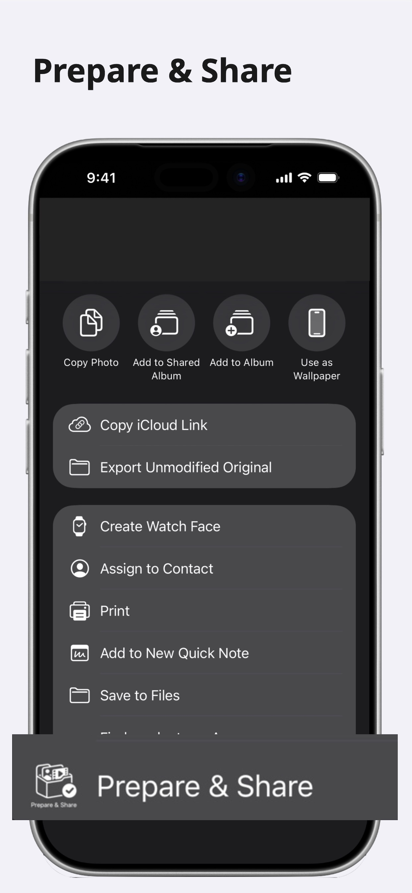
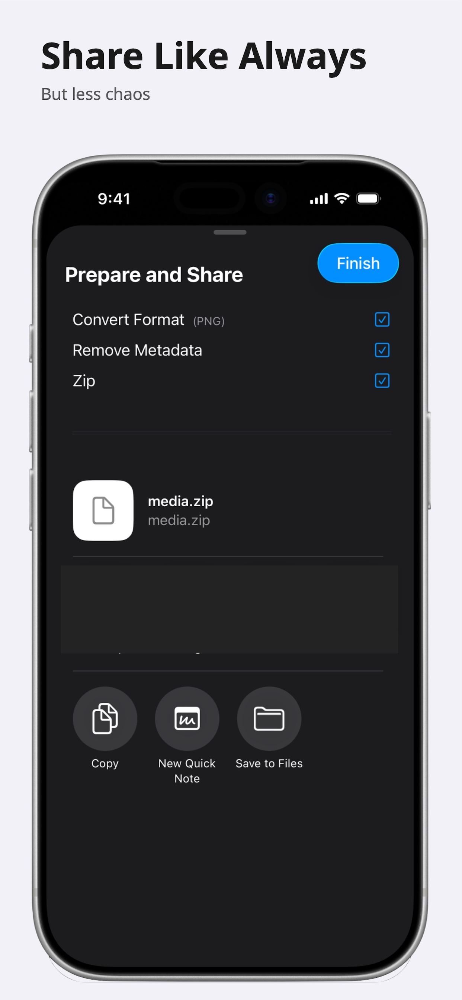

#  Media Ready

<h2>Prepare media for sharing in one tap.</h2>

MediaReady makes photos and videos easier to share.

Before sending, quickly:

1. Convert HEIC to JPEG or PNG
2. Remove metadata
3. Zip multiple files into a single archive

Built directly into the iOS share sheet for a fast, lightweight workflow.

No accounts. No cloud uploads. No complicated options.

Just prepare and share.

---

## Screenshots

  
  

  
  

<!-- ---

## Download

[Download on the App Store](https://apps.apple.com/us/app/id6767761886) -->

---

© 2026 Itsuki

